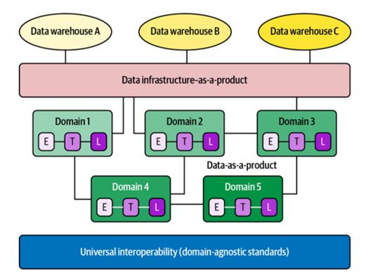
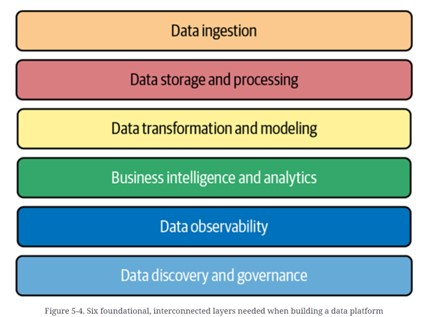

# 1\. Data in production:
"data in production" refers to data from source systems (like CRMs,
CMSs, and databases from any of the other analogies previously
mentioned) that has been ingested by your warehouse, data lake, or other
data storage and processing solutions and flows through your data
pipeline (extract-transform-load, or ETL) so that it can be surfaced by
the analytics layer to business users.

# 2\. Data Mesh:
-   Unlike traditional monolithic data infrastructures that handle the
    consumption, storage, transformation, and output of data in one
    central data lake, a data mesh supports distributed, domain-specific
    data consumers and views "data-as-a-product," with each domain
    handling their own data pipelines.

-   Data meshes federate data ownership among domain data owners who are
    held accountable for providing their data as products, while also
    facilitating communication between distributed data across different
    locations.

-   While the data infrastructure is responsible for providing each
    domain with the solutions with which to process it, domains are
    tasked with managing ingestion, cleaning, and aggregation of the
    data to generate assets that can be used by business intelligence
    applications.

-   Each domain is responsible for owning their pipelines, but there is
    a set of capabilities applied to all domains that stores, catalogs,
    and maintains access controls for the raw data.

-   Once data has been served to and transformed by a given domain, the
    domain owners can then leverage the data for their analytics or
    operational needs.

# 3\. Data warehouses and data lake:
Data warehouses require "schema on write" access, meaning we set the
structure of the data at the instant it enters the warehouse. Unlike
data warehouses, data lake architectures permit "schema on read" access.
This means we infer the structure of the data when we're ready to use
it. The following functionalities are helping data lakehouses further
blur the lines between the two technologies:

-   High-performance SQL: technologies like Presto and Spark provide a
    SQL interface at close to interactive speeds over data lakes. This
    opened the possibility of data lakes serving analysis and
    exploratory needs directly, without requiring summarization and ETL
    into traditional data warehouses.

-   Schema: file formats like Parquet introduced more rigid schema to
    data lake tables, as well as a columnar format for greater query
    efficiency.

-   Atomicity, consistency, isolation, and durability (ACID): lake
    technologies like Delta Lake and Apache Hudi introduced greater
    reliability in write/read transactions, and took lakes a step closer
    to the highly desirable ACID properties that are standard in
    traditional database technologies.

-   Managed services: for teams that want to reduce the operational lift
    associated with building and running a data lake, cloud providers
    offer a variety of managed lake services. For example, Databricks
    offers managed versions of Apache Hive, Delta Lake, and Apache Spark
    while Amazon Athena offers a fully managed lake SQL query engine and
    Amazon's Glue offers a fully managed metadata service.

# 5\. Data Quality Metrics:

-   Build a list of questions to start with, like "Is the data
    up-to-date?", "Is the data complete?", "Are fields within expected
    ranges?", "Is the null rate higher or lower than it should be?" and
    "Has the schema changed?".

-   Scalability: batching the calls, optimizing the queries for scale,
    deduplicating, normalizing the various schemas, and storing all this
    information in a scalable store.

-   Follow steps: mapping schema to map inventory (all possible tables),
    monitoring for data freshness and volume, building query logs to
    store the history of all queries, health check by tracking health
    metrics over time and comparing them to past batches.

-   Data Catalog: serve as an inventory of metadata and give
    stakeholders the information necessary to evaluate data
    accessibility, health, and location. Data catalogs can be used to
    store metadata that gives stakeholders a better understanding of a
    specific source's lineage, thereby instilling greater trust in the
    data itself. Additionally, data catalogs make it easy to keep track
    of where personally identifiable information can both be housed and
    sprawl downstream, as well as who in the organization has the
    permission to access it across the pipeline.

# 6\. Collecting Data, like:

-   Application Log Data

-   API Response

-   Sensor data

# 7\. Cleaning Data, like:

-   Outlier removal: statistical techniques like standard scoring, or
    more snazzy algorithmic techniques like isolation forests, to remove
    the outliers.

-   Assessing dataset features

-   Normalization: popular choices include L1 ("Manhattan") Norm, L2
    ("Unit") Norm, demeaning, and unit variance

-   Data reconstruction: mostly are dealing with missing data. To
    recover missing values, using techniques like interpolation,
    extrapolation, or categorizing/labeling similar data.

-   Time zone conversion

-   Type coercions

# 8\. Ensure Data Quality during ETL:

-   In the extract step, raw data is exported from some number of
    upstream sources and moved into a staging area.

-   Next, the transform step includes filtering, performing both type
    and unit conversions. May also perform encryption at this step for
    sensitive data fields or to meet industry or government regulations,
    and conduct data governance audits or data quality checks.

# 9\. Data Observability:

-   Monitor for freshness: setup a strong indicator of when critical
    data were last updated (for example, check how many rows/data have
    been added in certain duration, like daily, monthly or seasonally;
    check null values; data is up-to-date or not).

-   Understanding distribution: understand the expected values in the
    data (for example, Gaussian distribution with z-score). Trace
    extreme values and check lineage information to identify the
    possible root causes (like schema changes).

-   Anomaly detection for schema changes and lineage: keep track those
    changes.

-   Visualizing lineage

# 10\. Data reliability architecture:

-   Measuring and maintaining high data reliability at ingestion:
    including data cleaning, data wrangling (enrich and structure) and
    data quality testing (for example to check null values, freshness,
    volume, distribution, and missing values).

-   Measuring and maintaining data quality in the pipeline: monitoring
    to track data quality in production pipelines and observability.

-   Understanding data quality downstream:

    -   Service-level: Service-level agreements (SLAs) is to establish
        customer promises and punishments for missing service-level
        objectives. Service-level objectives (SLOs) are the actual
        targets being setup (in other words, individual promises for the
        customer). Service-level indicators (SLIs) are the specific
        numbers being measured in SLAs (like a threshold). Companies use
        SLOs to define and measure the SLA a given product, internal
        team, or vendor will deliver, along with potential remedies if
        those SLAs are not met.

    -   A net promoter score measuring how satisfied your stakeholders
        are with the data, including:

        -   Completeness: How complete is my data?

        -   Timeliness: data arrive on time?

        -   Validity: data meet all syntax requirements (i.e., format,
            type, or range) or not

        -   Accuracy: describe the real-world environment it's trying to
            represent?

        -   Consistency: data consistent against well-understood and
            accepted definitions?

        -   Uniqueness: no duplication?

    -   A data reliability dashboard that tracks the time to detection
        (TTD), time to resolution (TTR), and other data quality metrics
        after data lands in the dashboard. A list to tract like below:

        -   The ratio of data to irrelevant or erroneous data (in other
            words, how much of that data is missing, inaccurate, or
            stale)

        -   The number of null or missing values in a given data set, or
            the completeness of data

        -   The timeliness of data (in other words, was data late?)

        -   The percent of duplicated values (which accounts only for
            uniqueness of data and not any of the other possible ways
            data can break)

        -   The consistency of data (i.e., does each value in this row
            or column have the same format and size?)

-   Building data platform

-   Developing trust in data:

    -   Data observability

    -   Measuring the ROI on data quality

        -   Calculating the cost of data downtime: time to detection
            (TTD) and time to resolution (TTR). (TTD hours + TTR hours)
            × Downtime hourly cost = Cost of data downtime

        -   Updating the downtime cost to reflect external factors:
            Labor cost + Compliance risk + Opportunity cost = Annual
            cost of broken data

    -   How to set SLAs, SLOs, and SLIs for the data:

        -   Defining data reliability with SLAs: to start, assess the
            historical performance of your data to get a baseline metric
            of reliability. Then, consult stakeholders and setup the
            definition of reliability. Gather feedbacks from their
            consumers on what reliability looks like to them, if
            possible.

        -   Measuring data reliability with SLIs: setup a baseline (for
            example, the number of data incidents for a specific data
            asset, the frequency with which a critical table is updates,
            or the expected distribution for a given dataset).

        -   Tracking data reliability with SLOs: track TTD, build
            dashboards, and etc.

# 11\. Root Cause Analysis:

-   Look at your lineage: DAG

-   Look at the code, data and operational environment.

-   Leverage with your peers.

# 12\. Building End-to-End Lineage

-   Basic Lineage Requirements:

    -   Fast time to value

    -   Secure architecture

    -   Automation

    -   Integration with popular data tools

    -   Extraction of column-level information

-   Data Lineage Design:

    -   The destination table, stored in the downstream report.

    -   The destination fields, stored in the destination table.

    -   The source tables, stored in the data warehouse.

-   Parsing the Data: provides rich context and metadata about the
    represented tables and fields without burdening the user with
    superfluous information.

-   Building the User Interface.

# 13\. Prioritizing Data Governance and Compliance:

-   Prioritizing a Data Catalog: build their own data catalogs to ensure
    data compliance, but may time and resource consuming; ML-powered
    data catalogs on the market.

-   Beyond Catalogs: enforcing data governance, such as data
    accessibility and securit
