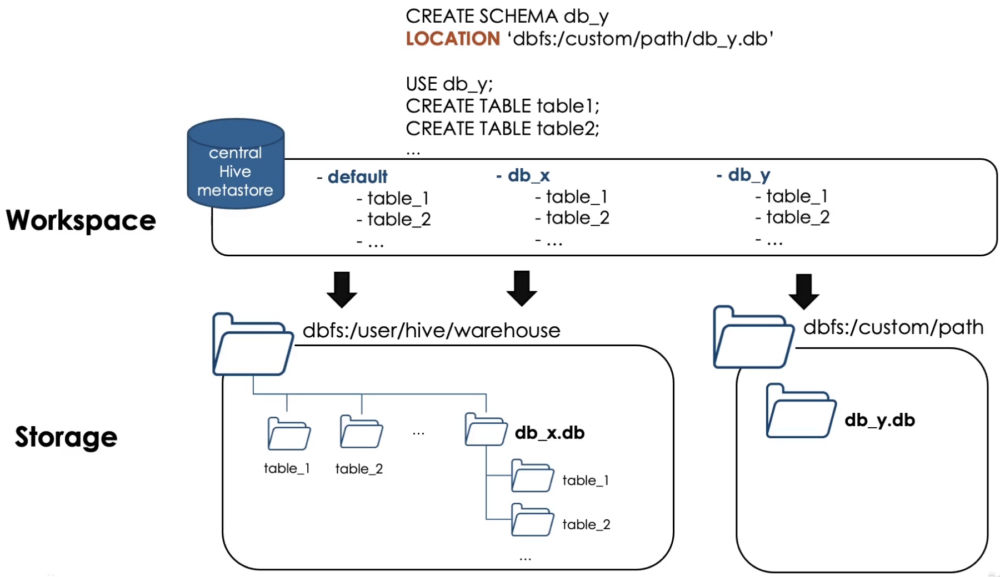
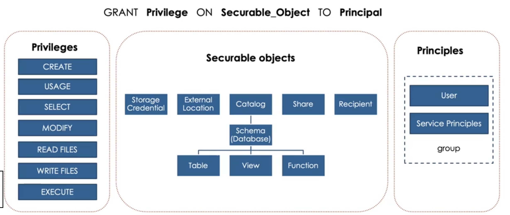

# Databricks DE Associate Certificate Prepartion

## Databricks lakehouse platform

- Databricks: multi-cloud lakehouse platform based on Apache Spark
- Lakehouse: one platform that unify all data engineering, analytics and AI workloads
  - has benefits from
    - Data warehouse: reliable, strong governance, performance
    - Data Lake: open, flexible, ML support
- 3-layer platform (bottom -> top)
  - Cloud service: AWS, Azure, GCP
  - Runtime: Spark, Delta lake
    - dbx uses the infras of cloud provider to provision VMs that pre-installed databricks runtime
  - Workspace: data engineering, sql, ML
- how dbx resources are deployed in Cloud (2 planes):
  - data plane: customer cloud account
    - Cluster VMs
    - Storage (DBFS)
  - control plane: databricks account
    - web UI
    - cluster management
    - workflows
    - notebooks
- Spark on dbx
  - in-memory, distributed data processing
  - all languages support
    - scala, python, sql, r, java
  - batch processing & streaming processing
  - structured, semi-structured, and unstructured data
- Databricks File System (dbfs)
  - distributed file system
  - preinstalled in databricks cluster
  - abstraction layer: data persists to the underlying cloud storage (`mount`)
- Cluster
  - a set of nodes/computers working together like a single entity
  - two types of nodes on a cluster:
    - master(driver) node: coordinate the workers and their parallel execution of tasks
    - worker node: execute tasks
- Notebook
  - magic commands
    - `%sql`
    - `%md`
    - `%run`: run other notebooks inside the current one
    - `%fs` or `dbutils`
- Delta lake
  - is:
    - open source tech
    - storage framework/layer
    - enable building lakehouse
  - is not:
    - proprietary tech
    - storage format/medium
    - data warehouse/database service
  - under the hood: parquet files + transaction logs
  - transaction log:
    - ordered records of every transaction performed on the table
    - single source of truth
    - json files contains commit info:
      - operation performed + predicates (conditions, filters...) used
      - data files affected (added/removed)
  - pros:
    - bring ACID transactions to object storage
    - handle scalable metadata
    - full audit trail of all changes (table history)
    - builds on standard data formats: parquet + json
  - sql commmand:

    ```sql
    -- view metadata information about a table
    DESCRIBE DETAIL table_name
    -- view table history
    DESCRIBE HISTORY table_name
    ```

  - advanced features
    - time travel:
      - `describe history`
      - query older versions

        ```sql
        -- using timestamp
        SELECT * FROM my_table TIMESTAMP AS OF "2019-01-01"

        -- using version number
        SELECT * FROM my_table VERSION AS OF 36
        SELECT * FROM my_table@v36
        ```

      - rollback versions

        ```sql
        RESTORE TABLE my_table TO TIMESTAMP AS OF "2019-01-01"
        RESTORE TABLE my_table TO VERSION AS OF 36
        ```

    - compaction
      - compacting small files: `OPTIMIZE my_table`
      - indexing: co-locate column information (`OPTIMIZE my_table ZORDER BY column_name`)
    - vacuum (not time travel)
      - clean up unused data files
        - uncommitted files
        - files that are no longer in latest table state
      - `VACUUM table_name [retention period]`
        - default retention: 7 days
        - if we only want to pertain the latest version, need to `SET spark.databricks.delta.retentionDurationCheck.enabled = false` then `VACUUM table RETAIN 0 HOURS`
- Database
  - schemas in hive metastore

    ```sql
    CREATE DATABASE db
    CREATE SCHEMA db
    ```

  - hive metastore: repository of metadata such as databases, tables, etc.

    

- Table
  - managed table
    - created under the database dir
    - drop table, also delete the underlying data files
  - external table
    - created outside the database dir
    - `CREATE TABLE table LOCATION "path"`
    - drop the table, will **NOT** delete the underlying data files
  - CTAS:

    ```sql
    CREATE TABLE table_1 
    COMMENT "Contains PII"
    PARTITIONED BY (city, birth_date)
    LOCATION '/path/'
    AS SELECT id, name, email, dob AS birth_date, city FROM user
    ```

    - auto infer schema fromm query results
    - don't support manual schema declaration
    - table created with data
    - filter and rename cols
  - Constraints

    ```sql
    ALTER TABLE table ADD CONSTRAINT constraint_name constraint_details

    ALTER TABLE orders ADD CONSTRAINT valid date CHECK (date > '2022-01-01')
    ```

    - NOT NULL
    - CHECK
  - Clone delta table: useful to set up tables for testing in development, data modifications will not affect the source
    - DEEP CLONE
      - fully copy data + metadata from source to target
      - can sync changes
      - take quite a while for large datasets

      ```sql
      CREATE TABLE target_table DEEP CLONE source_table
      ```

    - SHALLOW CLONE
      - just copy the delta transaction logs
- View
  - logical query against source tables (CREATE VIEW AS)
  - types of views
    - stored view:
      - persist objects (CREATE VIEW AS query)
      - dropped only by DROP VIEW
    - temporary view:
      - session-scoped view (CREATE TEMP VIEW AS query)
      - dropped when session ends
    - global temp view:
      - cluster-scoped view (CREATE GLOBAL TEMP VIEW AS query)
      - dropped when cluster restarted
      - query: `select * from global_temp.view_name`
- Create a new Spark Session
  - opening a new notebook
  - detaching and reattaching to a cluster
  - installing a python package
  - restarting a cluster

## ELT with Spark SQL and Python

- Querying files directly
  - file format
    - self-describing formats: json, parquet, ...
    - extract text files as raw strings
      - text-based files (json, csv, tsv, txt)

      ```sql
      SELECT * FROM text.`/path/to/filee`
      ```

    - extract files as raw bytes
      - image/unstructured data

      ```sql
      SELECT * FROM binaryFile.`/path/to/file`
      ```

  - file path:
    - single file: file_2022.json
    - multiple files: file_*.json
    - complete dir: /path/dir

  ```sql
  SELECT * FROM file_format.`/path/to/file`
  ```

  - CTAS: registering tables from files
    - auto infer schema from query results
    - not support manual schema declaration
    - useful for external data ingestion with well-defined schema (json, parquet, tables...)
    - not support file options

  ```sql
  CREATE TABLE table AS SELECT * FROM file_format.`/path/to/file`
  ```

  - Registering tables on external data sources(eg. csv files)
    - external tables: point to files stored in an external location
    - limitation:
      - not delta table
      - performance issue
        - solution: `CREATE TEMP VIEW USING ...` -> `CTAS`

  ```sql
  CREATE TABLE table (col1 col1_type, ...)
  USING data_source
  OPTIONS (key1 = val1, key2 = val2, ...)
  LOCATION = path

  CREATE TABLE table (col1 col1_type, ...)
  USING CSV
  OPTIONS (header = 'true', delimiter = ';')
  LOCATION = path

  CREATE TABLE table (col1 col1_type, ...)
  USING JDBC
  OPTIONS (url = 'jdbc:sqlite://hostname:port', dbtable = 'database.table', user = 'username', password = 'pwd') 
  ```

- writing to tables
  - CREATE OR REPLACE TABLE AS SELECT
  - INSERT OVEWRITE SELECT
    - cannot overwrite/modify the schema
    - safer technique for overwriting an existing table w/o the risk of modifying the table schema
  - INSERT INTO: add records to the table (no guarantee on duplicates)
  - MERGE INTO: avoid duplicates, upsert
  
  ```sql
  MERGE INTO target t
  USING source s
  on t.customer_id = s.customer_id
  WHEN MATCHED AND c.email IS NULL AND s.email IS NOT NULL THEN
    UPDATE SET email = s.email, updated = s.updated
  WHEN NOT MATCHED THEN INSERT *
  ```

- Advanced transformations

```sql
-- `profile` col is a nested json string, use : to extract contents
select profile:first_name, profile:address:country
from customers

-- convert json data to struct type
from_json(profilee, schema_of_json("{json_schema_extract_from_data}"))

-- `profile_struct` col is a nested struct type, use . to extract contents
select profile_struct.first_name, profile_struct.address.country from customers

-- use * to flatten fields into columns
select profile_struct.* from customers
```

```sql
-- explode: each element of array to row
select explode(books) from orders

-- collect_set: aggregation function, merge rows into array without duplicates
-- collect_list: similar to collect_set with duplicates
-- to flatten: use flatten(collect_set(col))
select
  customer_id,
  collect_set(books.book_id) as before_flatten,
  array_distinct(flatten(collect_set(books.book_id))) as after_flatten
from orders
group by customer_id 
```

- Higher Order Functions and UDFs

```sql
-- book is a list of dictionaries: [{'book_id': '809', 'quantity': 3, 'subtotal': 72}, ...]
-- filter: find books that has >= 2 copies
select order_id, books, filter(books, i -> i.quantity >= 2) as multiple_copies
from orders
where size(multiple_copies) > 0 -- filter on size of list

-- transform
select order_id, books, transform(books, b -> cast(b.subtotal * 0.8 as int) as subtotal_after_discount) from orders

-- udf
create or replace function get_url(email string)
returns string

return concat("https://www.", split(email, "@")[1])

describe function [extended] get_url
```

## Incremental Data Processing

- data stream
  - any data source that grows over time
  - new files landing in cloud storage
  - updates to a db captured in a CDC feed
  - events queued in a pub/sub messaging feed

- structured streaming

  ```py
  streamDF = spark.readStream.table('Input_table')
  #  awaitTermination: block the execution of any cell in this notebook until the incremental batch's write has been succeeded
  streamDF.writeStream
          .trigger(availableNow=True)
          .outputMode('append')
          .option('checkpointLocation', '/path')
          .table('output_table')
          .awaitTermination()
  ```

  - trigger types

  | Trigger | Method call | Behavior |
  |:---|:---|:---|
  | Unspecified |  | Default: processingTime="500ms" |
  | Fixed interval | .trigger(processingTime='5 minutes') | Process data in micro-batches at the user-defined intervals |
  | Triggered batch | .trigger(once=True) | Process all available data in a single batch, then stop |
  | Triggered micro-batches | .trigger(availableeNow=True) | Process all available data in multiple micro-batches, then stop |

  - outputMode

  | Mode | Method call | Behavior |
  |:---|:---|:---|
  | Append (Default) | .outputMode('append') | Only newly appended rows are incrementally appended to the target table with each batch |
  | Complete | .outputMode('complete') | The target tablee is **overwritten** with each batch |

  - checkpoint
    - store stream state
    - track the progress of stream processing
    - cannot be shared between separate streams
  - guarantees
    - fault tolerance: checkpointing + write-ahead logs
      - record the offset range of data being processed during each trigger interval
    - exactly-once: idempotent sinks
  - unsupported operations
    - sorting
    - deduplication

- incremental data ingestion
  - loading new data files encountered since the last ingestion
  - reduces redundant processing
  - 2 mechanisms:
    - COPY INTO
      - idempotently and incrementally load new data files
        - files that has already been loaded are skipped

      ```sql
      COPY INTO table
      FROM '/path/to/files'
      FILEFORMAT = <format>
      FORMAT_OPTIONS (<format options>)
      COPY_OPTIONS (<copy options>)

      FILEFORMAT = CSV
      FORMAT_OPTIONS ('delimiter' = '|',
                      'header' = 'true')
      COPY_OPTIONS ('mergeSchema', 'true')
      ```

    - Auto loader
      - structured streaming
      - can process billions of files
      - support near real-time ingestion of millions of files per hour
      - pyspark API

      ```py
      spark.readStream
             .format('CloudFiles')
             .option('cloudFiles.format', <source_format>)
             .option('cloudFiles.schemaLocation', <schema_dir>)
             .load('/path/to/file')
           .writeStream
             .option('checkpointLocation', <checkpooint_dir>)
             .option('mergeSchema', 'true')
             .table(<table_name>)
      ```

    - COPY INTO vs Auto Loader
      - COPY INTO:
        - thousands of files
        - less efficient at scale
      - Auto Loader:
        - millions of files
        - efficient at scale

- Multi-hop pipeline
  - medallion arch
  - organize data in multi-layered approach
  - incrementally improve the structure and quality of datat as it flows through each layer
  - benefits
    - simple data model
    - enables incremental ETL
    - combine streaming and batch workloads in unified pipeline
    - can recreate tables from raw data at any time

## Prooduction Pipelines

- delta live table
  - `LIVE TABLE`, `LIVE VIEW`, `STREAMING LIVE TABLE`
  - `select * from LIVE.table`: read data from a live table
  - `CONSTRAINT valid_order_number EXPECT (order_id IS NOT NULL) ON VIOLATION DROP ROW`
- CDC: change data capture
  - process of identifying changes made to data in the source and delivering those changes to the target
  - row-level changes: insert, update, delete
  - CDC feed: row data + metadata
  - cdc with dlt: `APPLY CHANGES INTO`
    - pros:
      - orders late-arriving records using the sequencing key
      - default assumption is that rows will contain inserts and updates
      - can optionally apply deletes (APPLY AS DELETE WHEN condition)
      - can specify >= 1 fields as the primary key for a table
      - can specify columns to ignore with the EXCEPT keyword
      - supoort apply changes as SCD Type 1 (default) or Type 2
    - cons:
      - break the append-only requirements for streaming table sources
        - cannot perform streaming queries against the table

  ```sql
  APPLY CHANGES INTO LIVE.target
  FROM STREAM(LIVE.cdc_feed_table)
  KEYS (key_fields)
  APPLY AS DELETE WHEN operation_field = 'DELETE'
  SEQUENCE BY sequence_field
  COLUMNS *
  ```

## Data Governance

- data governance model: programmatically grant, deny, and revoke access to data objects
- GRANT

  ```sql
  GRANT privilege ON object <object_name> TO <user_or_group>

  -- if we want to grant hr_team access on hr_db
  GRANT SELECT, MODIFY, READ_METADATA, CREATE ON SCHEMA hr_db TO hr_team;

  -- if users want to perform any action on a database object, we also need to grant USAGE to hr_team
  GRANT USAGE ON SCHEMA hr_db TO hr_team;
  ```

  - object: CATALOG, SCHEMA, TABLE, VIEW, FUNCTION, ANY FILE
  - privilege:
    - SELECT
    - MODIFY: add, delete, and modify data to or from an object
    - CREATE
    - READ_METADATA
    - USAGE: No effect! required to perform any action on a database object)
    - ALL PRIVILEGES
  - grant privileges by role: catalog -> schema -> table/view/function

    |Role|Can grant access privileges for|
    |:---|:---|
    |dbx admin|all objects in catalog and underlying filesystem|
    |Catalog owner|all objects in catalog|
    |Database owner|all objects in database|
  
  - `ANY FILE` can not be granted in Data Explorer, have to run SQL command in editor
- Unity catalog
  - centralized governance solution across all workspaces on cloud
  - unify governance for all data and AI assets
    - files, tablees, ML models, dashboards
    - based on SQL
  - UC sits out of the workspace and access via a UI called Account Console (can be assigned to >= 1 workspace)
    - user/group management
    - uc metastores
    - access control
  - 3-level namespace
    - UC metastores -> catalog -> schema -> table/view/function

    ```sql
    SELECT * FROM catalog.schema.table
    ```

    - UC also supoort authentication to the cloud storage through Storage Credential
    - add Shares and Recipients related to delta sharing
      - shares are collection of tables shared with >=1 recipient
  - Identities
    - Users: identified by email address
      - a user can have an account admin role to perform several admin tasks in UC like managing/assigning metastores to workspace and managing other users
      - service principal: identified by application ids
        - is an individual identity for use with auto tools and applications
        - can have admin role that allow them to programmatically carry out admin tasks
      - groups: grouping users and sp
        - can be a nested group:
          - eg. employees group can contain 2 inner groups: HR + Finance
  - Identity Federation
    - identities exist at 2 levels:
      - account-level
      - workspace-level
    - uc allows us to create identity in the account console at once and assign them to >=1 workspace
  - Privileges
    - CREATE, USAGE, SELECT, MODIFY
    - READ FILES, WRITE FILES <- replace ANY FILE in hive_metastore
    - EXECUTE: allow executing UDF
  - Security Model

    
  
  - Features
    - centralied governance for data and AI
    - built-in data search and discovery
    - automated lineage
    - no hard migration required

## Reference

1. https://www.udemy.com/course/databricks-certified-data-engineer-associate/