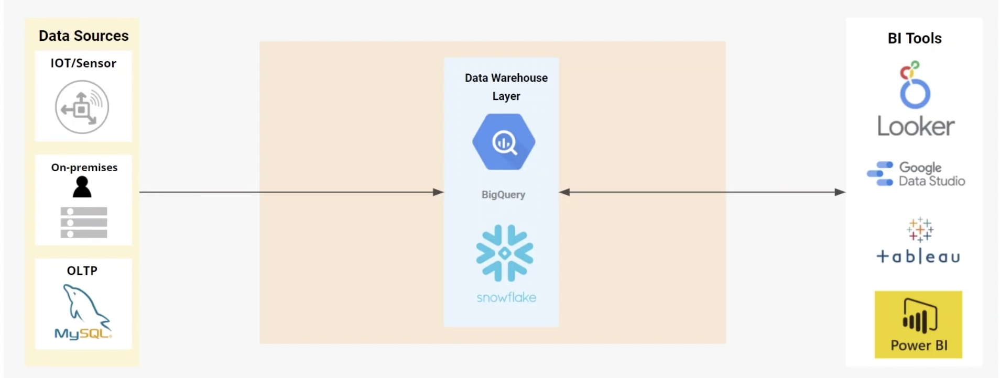
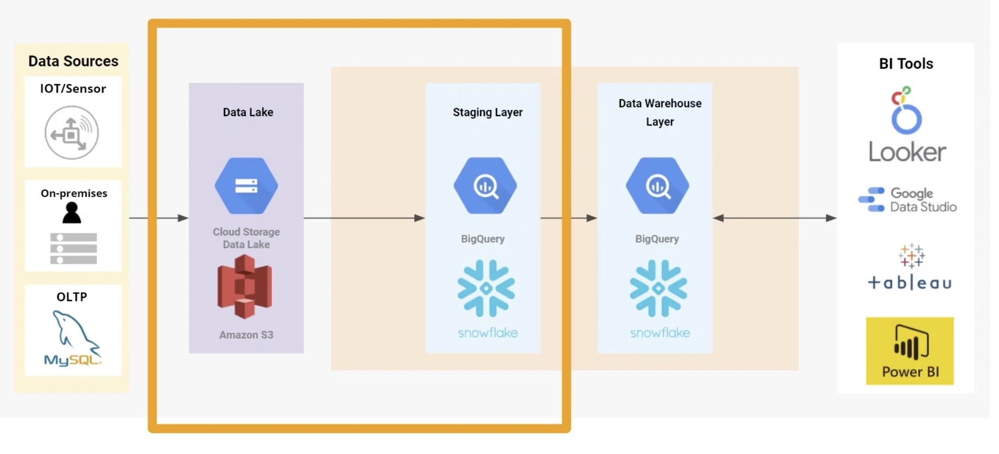
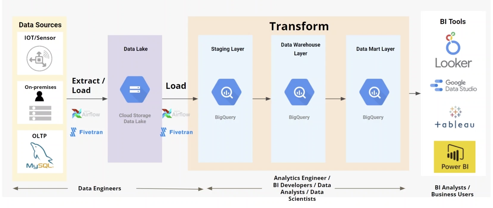
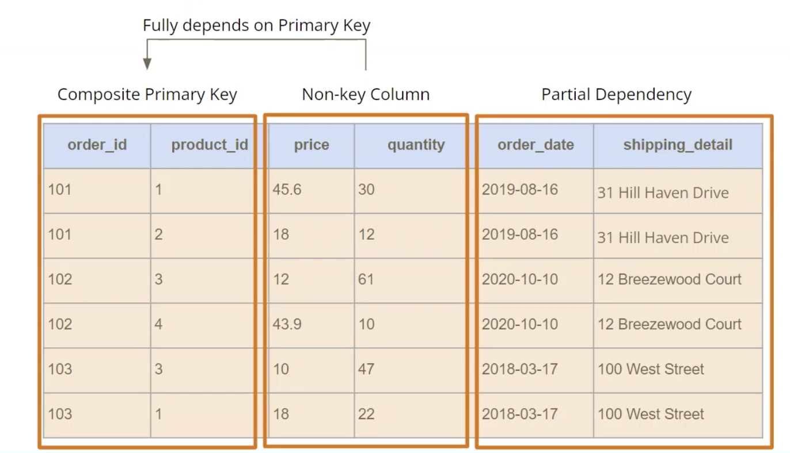
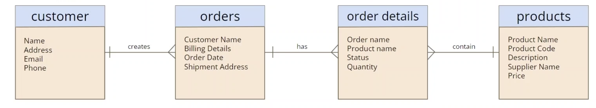
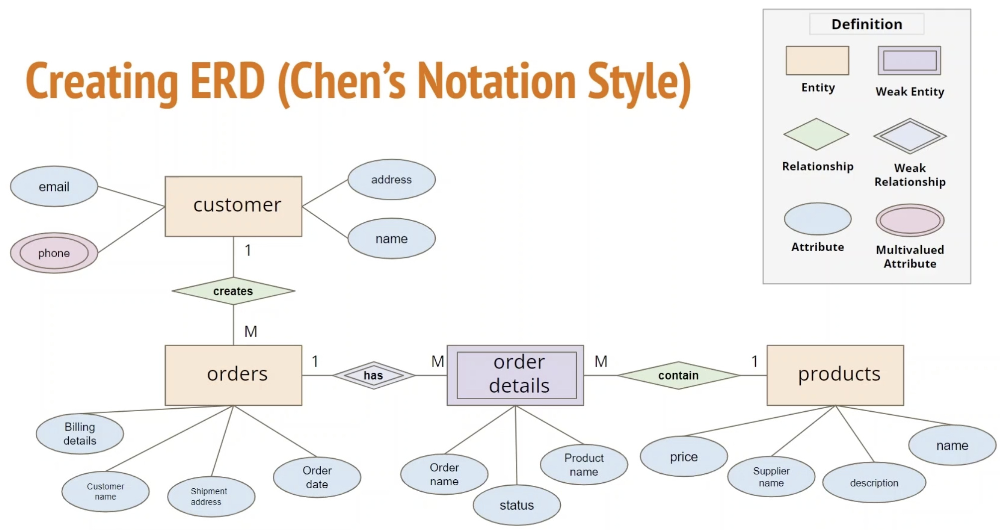
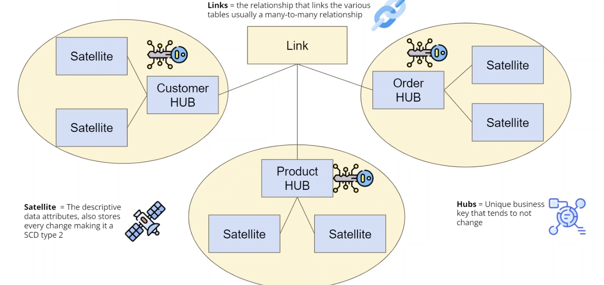

# Data Warehouse(DW)

## DW Introduction

### OLTP/OLAP

|  | OLTP | OLAP |
|:---|:---|:---|
| Purpose | Transaction; control and run essential operations in real-time | Analytics; reporting, discover insights, support decisions |
| Data updates | Short, fast updates, ACID | Refreshes periodically, scheduled batch processing |
| DB design | Normalized DB for efficiency | Denormalized DB for downstream analysis (dimensional model) |
| Space requirements | Generally small if historical data is archived | Generally large due to aggregating large data |

### Characteristic of DW

- subject-oriented
  - focus on a subject
  - not on operational day to day
- integrated
  - data from different sources
  - data is uniformly transformed
  - well-defined schema
- time-variant
  - data is organized in time periods
  - contains element of time eitther implicitly or explicitly
- non-volatile
  - only loading and accessing data is allowed
  - daat is refreshed att scheduled time

### DW Architecture

- single-tier
  
  

  - all of source data is stored directly inside data warehouse layer
  - pro: save data storage and reduce redundancies
  - con: query data directly from dw that make BI tools slow down returning results
- two-tier
  
  

  - separate between sources and dw
  - add data lake and staging layer before dw layer
    - prevent dw being the main area of stored raw data
    - data lake: single storage area for all source data
    - staging layer: can do any transformation/cleaning before storing data in dw

- three-tier
  
  

  - add data mart layer
    - enable BI insight through data mart layer
    - model data to serve specific business purpose
  - three-tier
    - bottom tier: data source, data lake, staging
    - middle tier: data warehouse layer, data mart layer
    - top tier: BI tools/dashboards

### Data Lake

- single store of raw data, cost-effective storage
- data can be structured, unstructed, images, log, etc.
- data is in raw format
- give us better data governance

### 5V in Big Data

- volume: large amount of data
- velocity: speed of data processing
- variety: different types of data
- veracity: the level of trust in the data
- value: the value within the data

### DL vs DW

|  | DL | DW |
|:---|:---|:---|
| Data Structure | Structured, unstructured, raw from all the available sources | Structured, processed data after applying transformation/clean up |
| Users | DE, DS | BI developer, Analyst |
| Schema-position | Schema-on-read | Schema-on-write |
| Purpose | Location to store all raw data | Defined purpose for BI, reporting |
| Storage | Low cost storage for large amount of data | Can be expensive to store large amounts of data |

### Staging Layer

- between data lake and dw
- mutliple data source aggregated at staging layer
- perform data cleaning, transformation, validations
- storing data in this layer makes processing easier

### DW Layer

- transformed data from staging layer
- data modelling (dimensional model, OBT, Data Vault)
- data masking, PII data
- optimization strategies
- metadata info is also stored for data lineage

### Data Mart

- subset of DW
- data is organized in small managable chunks
- source data for BI

### ETL

- Extract
  - extract data from the source
  - data goes into a temporary or persistent storage area
  - batch or streaming data
  - data validation checks (format, null values, new columns etc.)
- Transform: improve quality
  - cleansing: solve and clean any inconsistency
  - standardization: apply formatting rules
  - deduplication: remove duplicates and redundancies
  - verfication: flag anomalies and remove unusable data
  - sorting: organize by type
  - other tasks: other rules applied to improve data quality
- Load
  - load the transformed data into dw
  - conduct data quality check during load
  - recovery mechanism to handle load failure
  - types
    - full refresh load: load all data as fresh
    - incremental load: scheduled at intervals

### ETL vs ELT

|  | ETL | ELT |
|:---|:---|:---|
| volume | small/medium data volume | large data volume |
| load time | slow as transformation before loading to DW | fast loading as transformation happens later |
| data type | structured data | structured & unstructured data |
| complexity | compute-intensive & complex | less complex due to transformation within SQL |
| cost | high | low |
| availability | only required for reporting/analysis | everything can be accessed from DL |
| maintenance | high-maintenance due to on-premise solutions | low-maintenance due to cloud solution |
| data governance & security | removes PII before load | option to remove PII before load but require more work; PII is removed after load |

## Data Normalization

- normalization
  - organize data in database and part of modelling process
  - splits large tables into smaller ones and joins them together using relationships
  - reduce data anomalies and redundancies, improve data integrtiy
- functional dependency
  - each table only represents one area
  - each other columns depends on PK
  - composite keys can also create functional dependency
- 1st normal form
  - must have a PK
  - should only hold single valued attribute
  - must be atomic (value cannot be subdivided): (name -> first_name, last_name)
  - no repeating groups
- 2nd normal form
  - should be in 1NF
  - all non-key columns depends on PK
  - should not contain partial dependencies
    - pd: an attribute depends only part of a PK
    - order_date, shipping details depends only on order_id

      

- 3rd normal form (OLTP)
  - must be in 2NF
  - eliminate columns not dependent on PK
  - should not have transitive dependency
    - non-prime attibute depends on other non-prime attributes

### Pros/cons of Normalized Model

- Pros
  - reduce data redundancy
  - reduce size in storage
  - no data duplications
  - easy to maintain and make changes
- Cons
  - slow performance due to multiple joins
  - not for analytical purposes

### Denormalization

- optimization tech to speed up data retrieval
- requires adding redundancy to various tables
- techniques
  - add redundant columns
    - used for frequently accessed columns with large joins (avoid joins)
  - store derived columns (may need to have frequent update)
  - pre-joining tables
  
### Pros/cons of Denormalized Model

- pros
  - improve performance
  - less compute required
  - accelerate reporting
  - good for analytics
- cons
  - large storage size
  - less flexible
  - insert/updates can be complicated & expensive

### Normalization vs Denormalization

| Normalization | Denormalization |
|:---|:---|
| OLTP | OLAP |
| remove redundancy | add redundancy |
| reduce inconsistency | potential inconsistency |
| require more joins | less joins |
| complex data model | simpler data model |
| **faster data write** | **faster data read** |

## Data Model and Data Modeling

- data model: act as a blueprint, specify business requirements and data structures, provide visual way to communicatee with business at various level
- data modeling: structured approach to develop a data model by identifying and analyzing all the requirements
- data modeling workflow:
  1. identify business requirements
  2. collaborate with business: interviews, meetings, review existing processes
  3. define ERD notation, define data model type
  4. define data modeling method
  5. develop and deploy

- 3 types of data model
  - conceptual:
    - act as a business requirement reference (high level)
    - identify what data is used in business
    - show entities and relationship
    - no primary key or attributes
  - logical: (business model)
    - focus on business requirement, design of the data
    - add more info to the conceptual model
    - define PK, attributes, data type with coarse resolution
  - physical:
    - blueprint for developers
    - denormalization can occur
    - more details: tables, columns, PK/FK, cardinality, data types(lengths, nullable)

  | feature | conceptual | logical | physical |
  |:---|:---|:---|:---|
  | entity name | Y | Y | Y |
  | entity relationship | Y | Y | Y |
  | attributes |  | Y | Y |
  | table names |  |  | Y |
  | column names |  |  | Y |
  | column data types |  | Y | Y |
  | primary keys |  | optional | Y |
  | foreign keys |  | optional | Y |
  | target audience | business | architect | developer |

### Keys

- uniquely identity a record in a table
- types
  - PK
    - unique identifier
    - cannot be NULL, must be unique
    - candidate key
    - works best if it's numeric or integer data type
    - efficient for join, index, and sort
  - candidate key
    - any field that can be promoted to be PK
    - should be unique and NOT NULL
    - can have more than one CK in table
  - composite key
    - a type of PK
    - concatenation oof multiple columns
    - ensure uniqueness
  - natural key
    - a type of PK
    - real data within a table, have business meaning
    - eg. SSN, invoice number, etc
  - surrogate key
    - PK generated at runtime
    - no business meaning but just unique identifier (numeric value, guaranteed to be unqiue)
  - FK
    - used to join 2 tables
    - PK of parent entity
    - table that contains FK is called child table
    - FK enforces a referential integrity

### ERD Notation

- create a visual representation of entities and attributes
- provides preview of how tables should connect
- 3 components
  - Entity: the object from where data is collected (table)
  - Attribute: entity properties that can be identifiers or descriptor (column)
  - Relationship: the connection between entities
- styles (IE, Chen, Barker, UML)
  - IE:
    - most widely used
    - use lines with symbils to indicate relationships
    - use crow foot notation to represent cardinality

    

    - pros: most widely used, easy to understand, works well for designing physical model
    - cons: no standardization (lots of variation in notation)
  - Chen:
    - not widely used
    - use different shapes and text values to explain the relationships
    - shapes:
      - entity
      - weak entity:
        - rely on existence of another entity
        - cannot be identified by its attributes
        - doesn't have PK (usually take the PK of parent entity)
      - relationship
      - weak relationship
      - attribute
      - multivalued attribute

    

    - pros: easy to draw, understand, good for teaching concepts
    - cons: too busy to read, take more space, too much info provided (hard to understand at high level), not used much in industry

- IE vs Chen
  - cardinality:
    - one-to-one
      - one-and-only-one: `||` instead of `|`
    - one-to-many
    - many-to-one
    - many-to-many
      - better convert to either one-to-many/many-to-one (bridge tables)

    

- create an ERD
  1. identify entity
  2. relationship
  3. cardinality
  4. attributes

## DW Design Methodology

- Inmon
  - Corporate Information Factory (CIF
  - EDW (Enterprise DW) is the core, central repo for all business data
    - data is often structured in 3NF
  - data marts are created separately for each business function (DMs are built after DW built is fully completed)
  - top-down / data-drive approach
  - pros:
    - all data is integrated
    - low data redundancy
  - cons:
    - time-intensive
    - requires knowledge and understanding of the entire business
    - isolated data marts
    - not very agile

- Kimball
  - starts with key business processes/requirements (bottom-up)
  - focus is to enable BI fast
  - DM built before DW
  - dimensional model (denormalized, fact/dim tables)
  - pros:
    - quick to set up
    - agile approach to data modelling
    - easy to work with (denormalization)
    - faster query and analysis
    - allows self-service reporting
  - cons:
    - anomalies could arise due to the denormalization thus addtition of redundant data
    - not suitable for changing business requirements

- Data Vault
  - agile approach to build dw
  - hybrid approach (3NF + dimensional model/star schema)
  - every entity table (hub) is connected through a link table in a form of normalized tables
  - components:
    - hub
      - business entity
      - contains unique business keys (hash)
    - link
      - create relationship between different entities
      - many-to-many relationship (3NF)
      - link makes easier to add new sources
    - satellite (attribute)
      - contains attributes of original tables
      - similar to dim tables
      - subject to change over time
      - store changes at granular level (similar to SCD type 2)

    

    - pros:
      - allow historical data tracking
      - incremental builds that handle multiple soources
      - easy to handle changing business requirements
    - cons:
      - complex setup
      - not fit for small data sources
      - high learning curve
      - might lead to a loss of a single source of truth

- Inmon vs Kimball vs Data Vault

||Kimball|Inmon| Data vault
|:---|:--|:--|:---|
|Approach|bottom-up|top-down|hybrid/agile|
|Focus|individual business use-cases| enterprise data integration| enterprise integration|
|Data format|denormalized|normalized| in raw format (raw vault)|
|Delivery time|quick set up driving business value|takes lots of effort at the start and requires very deep expertises| quick to set up but very complex to model |
|Maintenence|low-medium|medium-high| high|

- Wide table/one big table (OBT)
  - one big denormalized table
  - remove all jois and pre-aggregated
  - faster query performance
  - ideal for getting started and for smaller project
  - for complex projects use OBT as part of star schema
  - pros:
    - quick data retrieval
    - fit for smaller teams
    - work pretty well for reporting purposes
  - cons:
    - not good for big DW
    - hard to maintain as denormalized tables can have duplicates
    - difficult to handle SCD
    - expensive update operations

## Dimensional Modelling

- fit for dw and BI applications
- denormalized structure, optimized for faster data retrieval

### Kimball dw lifecycle

### steps

- select the business process
  - capture performance metrics that will get translated into fact tables
- declare the grain (daily, hourly,...)
  - define level of detail for star schema
  - data should be stored as granular as possible
- identify the dimensions
  - who, what, where, when, why, how context of a business process
- identify the facts
  - measurements in numeric values that result from a business process

### dimensions

- contains descriptive fields for facts
- flat denormalized table
- type:
  - conformed dim:
    - common dims that are joined to multiple facts
    - every row is unique and is at atomic level
    - contains primary & surrogate keys
    - date dim is a conformed dimension
  - junk dim
    - dim with simple attributes (flag, yes/no, t/f, etc.), values don't change frequently
  - degenerate dim
    - dims without attributes that exist inside the fact table (eg, tracking number, order number etc.)
    - have high cardinality
    - stored in fact table to reduce duplicates
  - role-playing dim
    - same dimension used for multiple purpose
    - use date dimension instead (eg. order_date, due_date, cancelled_date)
  - SCD
    - dim that change over time
    - manages current and historical version (track changes)
    - type
      - type 0: retain original (no changes at all)
      - type 1: overwrite the old value (reflect the most recent assignment)
      - type 2: new additional row/record
        - add surrogate key(PK), current_flag column, date columns(valid_from, valid_to)
          - valid_to = NULL -> current record
      - type 3: add a new attribute column
      - type 4: use historical table to track changes separate to the dim table

### bridge table

- uses to resolve many-to-mnay relationshiop
- sits between fact and dim
- only contains key columns for various tables

### facts

- contains measurement created by operational systems
- at the lowest granularity captuerd by the buiness process
- PK is usually a composite key
- foreign key + measure
- type of facts (measure)
  - additive
    - measures that can be summed across any of the dimension within the fact table
  - semi-additive
    - measures that can be summed across some of the dimension within the fact table
  - non-additive
    - measures that cannot be summed across any of the dimension within the fact table
- type of fact tables
  - transaction: store one row per transaction
    - most common
    - lowest level of granualarity & date dim
    - additive measure
    - can grow large very quick
  - periodic
    - snapshot of data for specific time, aggregated table with some granularity
    - semi-additive
    - built from transaction fact table
    - smaller table size compared to transaction fact table
  - accumulating fact table
    - one row per entire lifetime of an event or product
    - has start, end date
    - update happens when each milestone is completed
    - smallest in table size
    - eg. processing of insurance, order...

### star schema

- simple structure to organize data within data warehouse
- fact table at the center of the star connects to the dim tables
- enable easier querying and understanding
- pros:
  - simpler queries compared to a normalized model
  - simplify business reporting
  - better query performance
- cons:
  - data integrity not enforced (denormalized form)
  - doesn't inform many-to-many relationships
  - dependent on business process

### snowflake schema

- normalize the data from star schema
- pros:
  - improve data quality
  - less storage
  - fit for data with deep hierarchies
  - easier to design/develop
- cons:
  - requires complex queries
  - increase number of joins
  - difficult for business user to understand data

### star vs snowflake

||Star schema| Snowflake schema|
|:---|:---|:---|
|data structure|denormalized|normalized on top of denormalized|
|storage required| more| less|
|performance|faster|slower|
|data redundancy|Y|N|
|organizational|better for data marts|better for warehouse|

## Reference

1. [Analytics-engineering-bootcamp](https://www.udemy.com/course/analytics-engineering-bootcamp/)
2. [DE-zoomcamp](https://www.youtube.com/watch?v=jrHljAoD6nM&list=PL3MmuxUbc_hJed7dXYoJw8DoCuVHhGEQb&index=26&ab_channel=DataTalksClub)