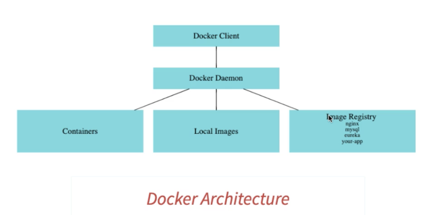

# Docker

## Concepts

### Virtualization

- purpose:
  - create a software-based virtual version of computer storage, servers, applications, etc.
  - to let us split one system into many different sections which act like separate, distinct individual systems

### Containerization

- purpose: run applications in an bug-free environment without worrying about different OS, dependencies, and configurations
- container: packages the application with all its dependencies and configuration files
- containerization platform: docker, kubernetes

### Virtualizatiton vs Containerization

- V: virtual machine is an abstraction of hardware layer, which is a physical machine
- C: container is an abstraction of application layer; it provides an isolated environment for running an application
  - any changes made in the container will never affect the host or other containers

### Docker images, containers

- image: source of docker container, used to create container
- container: runtime instance of docker image
- docker hub: the registry where the docker images live; users can pick up images from docker hub and build customized images/containers on top of them

### Docker Architecture

- Docker client: send commands to Daemon
- Docker Daemon (server): manage images/containers
- when running a container:
  - Daemon first check if it exists in local images
  - if not, check the image registry and download it

### Why docker

- standardized application packaging: same packaging for all types of applications
- multi-platform support: local machine, data center, cloud
- light-weight and isolation: light-weight compared to VMs, isolated from one another

### Dockerfile

- a text file that contains all the instructions/commands a user need to assemble an image
- use `docker build` to build an image

### docker compose

- used to set up multiple-container applications
- a yaml file which contains details about the services, networks, volumns for setting up applcaitioons

## Docker commands

[docker commands](../linux-cli/docker_cli.md)

## Reference

1. https://www.edureka.co/blog/interview-questions/docker-interview-questions/
