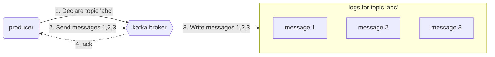
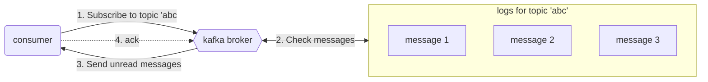
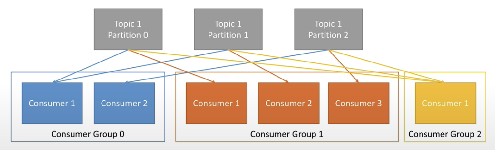
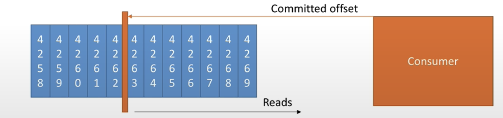

# Kafka

## Introduction

### message

- key: which partition/direction the message will go to
- value: the data you want to push to the consumer
- timestamp: when the broker receives the message or the timestamp you have set while producing the message

### topic

- topic: the category used to organize messages (store and publish a particular stream of data)
- producer pushes/writes messages to a topic
- consumer consumes/reads messages from a topic

### broker

- broker: physical machine on which kafka is running
- cluster: multiple brokers -> multiple machines working together

### logs

- data segments present in the disk
- store messages in order
  - assign sequence id to each message before storing in logs

### Producer sends messages to Kafka

### Consumer receives message from Kafka

### Consumer

- consumers read data in consumer groups
  - kafka treats consumers inside a consumer group as one entity
    - avoid reading duplicated message for different consumer
    - be able to horizontally scale the consumer application (different consumer read different messages at the same time)
- topic logs can be partitioned, which is used for scalability
  - increase partitions allows consumer grooup to increase the number of consumers to read data faster
- partitions are assigned to consumers inside the consumer group
  - a partiton -> one consumer only in a consumer group
  - 1 consumer may have multipe partitions assigned to it

  

- each consumer within a group reads from exclusive partitions
- you cannot have more consumers in a consumer group than partitions, otherwise some will be inactive
  - consumers share partitions

- `__consumer_offset`
  - kafka stores the offsets at which a consumer group has been reading
  - a topic that keeps track of message read by each consumer and topic
  - if a consumer process dies, it will be able to read back from where it left off to consumer offsets.

  

## Reference

1. https://github.com/ziritrion/dataeng-zoomcamp/blob/main/notes/06_streaming.md
2. https://www.youtube.com/watch?v=P1u8x3ycqvg&list=PL3MmuxUbc_hJed7dXYoJw8DoCuVHhGEQb&index=57&ab_channel=DataTalksClub%E2%AC%9B
3. https://www.youtube.com/watch?v=lAdG16KaHLs&ab_channel=StephaneMaarek