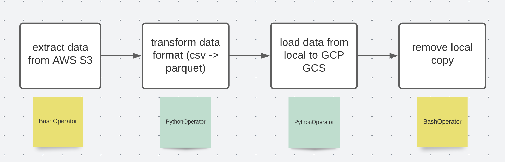

# Airflow

## Concepts

### Architecture

3 parts:

- web server: user interface to inspect, trigger, and debug the behavior of DAGs and tasks
- scheduler: schedule jobs, submit tasks to executors to run, monitor DAGs and tasks
  - worker: execute tasks given by the scheduler
- metadata database: use for web server, scheduler, executor to store the state of the environment

### Executor

- `LocalExecutor`: single-node
- `CeleryExecutor`: multi-node

### DAG

- directed acyclic graph (workflow)
- run series of tasks (in series and/or in parallel depending on the problem)
- python scripts
  - default_args of DAG
    - `catchup=True`: use to load the data in the past
  - Operator (operate tasks)
    - BashOperator
    - PythonOperator
    - ...
  - dependencies

    ```py
    task1 >> task2 >> task3
    task1 >> [task2, task3] >> task3
    ```

### [Crontab time schedule](https://crontab.guru/)

- 5 positions (from left to right)
  - [minute hour day_of_month month day_of_week]
  
  |Symbol|Description|
  |:--|:--|
  |*|any value|
  |,|value list operator|
  |-|range of values|
  |/|step values|

  - in particular
    - minute: 0 - 59 (allowable values)
    - hour: 0- 23
    - day_of_month: 1 - 31
    - month: 1 - 12, or JAN - DEC
    - day_of_week: 1 - 7
    - non-standard
      - @yearly
      - @annually
      - @monthly
      - @daily
      - @hourly
      - @reboot

    - for example
      - `5 4 3 2 1`: At 04:05 on day-of-month 3 and on Monday in February.

## Airflow Local Setup

[airflow-local-setup](airflow_local_setup.md)

## Hands-on section

### Workflow



- read/write large dataset to local: use [pyarrow](https://towardsdatascience.com/stop-using-pandas-to-read-write-data-this-alternative-is-7-times-faster-893301633475)

## Reference

1. https://github.com/DataTalksClub/data-engineering-zoomcamp/tree/main/week_2_data_ingestion